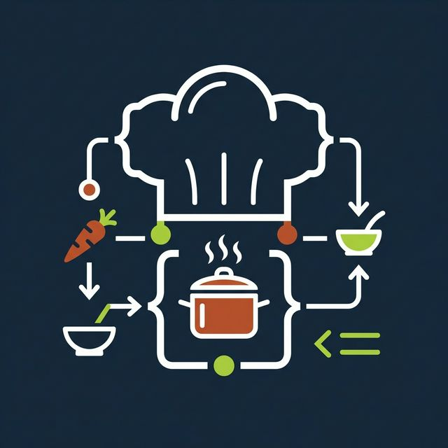
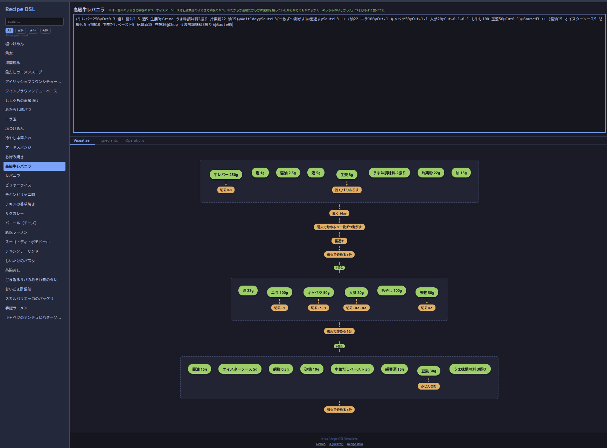

# CookFlow DSL — 料理レシピDSL可視化ツール



🌐 **[ライブデモ → https://hamko.github.io/recipe-dsl-visualizer/](https://hamko.github.io/recipe-dsl-visualizer/)**

**CookFlow DSL** は、テキストベースの料理レシピ言語（DSL）を解析し、フローチャートとして可視化するWebアプリケーションです。



## なぜ作ったか

理由はありません。

元々は [PukiWiki上のレシピページ](https://home.wakatabe.com/ryo/wiki/index.php?%E3%83%AC%E3%82%B7%E3%83%94) で自作ゆるふわ DSL を使ってレシピを管理していました。もともと DSL を作った理由は、世の中のレシピが意味もなくビジュアライズされていて読みにくいため、記号化して日常で使いやすくするためでした。実際、僕はこの記号化されたレシピを日常的に参照して料理を作ってきました。

つまり、ビジュアライズする必要など一切ありません。むしろこのビジュアライズソフトウェアは、管理すべきではないソフトウェアが増えるという点で害しか生みません。AIコーディングエージェント [Antigravity](https://blog.google/technology/google-deepmind/antigravity-ai-coding-agent/) を使えば簡単にWebアプリが作れるようになったので、特に意味もなくビジュアライザーにしてみました。

## 機能

- **レシピDSLエディタ**: 独自の簡潔な構文でレシピを記述できます。
- **フローチャート可視化**: 記述したレシピをリアルタイムでフローチャートに変換します。
- **材料リスト**: DSLから自動的に材料一覧を抽出して表示します。
- **調理手順リスト**: 操作の構文と意味を一覧表示します。
- **レシピ検索**: 部分文字列検索と、評価（★）によるフィルタリングに対応。
- **AI生成機能**: 自然言語のレシピテキストから、Gemini APIを使用してDSLを自動生成します。

## DSLの文法

### 基本要素

| 構文 | 意味 | 例 |
|------|------|-----|
| `材料名数量` | 材料 | `豚バラ500`, `水1.5合分` |
| `@操作名` | 操作 | `@Cut`, `@SauteL5` |
| `(...)` | グループ化 | `(卵3個 塩)@Mix` |
| `A ++ B` | Aを作り、Bを投入 | `スープ ++ 麺` |
| `A -> B` | Aの次にBの工程 | `@Boil -> @冷ます` |
| `;` | 別系統の手順 | `メイン; ソース` |
| `{コメント}` | 補足情報 | `@Wait30{常温で}` |

### 操作一覧

| 構文 | 意味 |
|------|------|
| `@Saute` / `@SauteL` / `@SauteH` | 炒める / 弱火で炒める / 強火で炒める |
| `@Boil` / `@BoilL` / `@BoilH` | 茹でる / 弱火で煮る / 強火で煮る |
| `@Cut` | 切る |
| `@Chop` | みじん切り |
| `@Slice` | スライス |
| `@Grind` | すりおろす |
| `@Mix` | 混ぜる |
| `@Oven180-5` | オーブン 180度 5分 |
| `@Microwave600-2min` | 電子レンジ 600W 2分 |
| `@Wait` | 置く・寝かせる |
| `@Pressure` | 圧力鍋 |
| `@RiceCook` | 炊飯 |
| `@Fry` / `@DeepFry` | 揚げる |
| `@Steam` | 蒸す |
| `@Refridgerator` | 冷蔵庫 |

### `++` 演算子の意味

`A ++ B` は単なる「合わせる」ではなく、**時間的な順序**を持ちます：

1. まず **A** を作る
2. そこに **B** を投入する

例：
```
(豚バラ500@Cut)@SauteL5 ++ 玉ねぎ1個@Slice
```
→ 豚バラを切って弱火で5分炒め、**そこに**スライスした玉ねぎを加える

### レシピ例

```
(豚バラ500@Cut)@SauteL5 ++ (玉ねぎ1個@Slice)@Saute 
-> 調味料(醤油30 酒30 砂糖10)@Mix 
-> @BoilL20
```

## 評価システム

レシピのコメント内容に基づいて5段階評価を自動判定します：

| 評価 | 条件 |
|------|------|
| ★★★★★ | コメントに「つまぴが好き」を含む |
| ★★★★ | コメントに「おいしい」「美味しい」を含む |
| ★★★ | 特にキーワードなし（デフォルト） |
| ★★ | コメントに「おいしくない」「微妙」を含む |

## GitHub Pagesについて

このアプリケーションは静的ホスティング（GitHub Pages等）で動作します。

- **AI生成機能**: GitHub Pages上では非表示になります。ローカル環境でのみ利用可能です。
- **APIキー**: Gemini API Keyはブラウザの`localStorage`に保存されます。個人利用を想定しています。

## 開発・実行方法

```bash
# インストール
npm install

# 開発サーバー起動
npm run dev

# ビルド
npm run build

# テスト実行
npx vitest run
```

## リンク

- [GitHub リポジトリ](https://github.com/hamko/recipe-dsl-visualizer)
- [X (Twitter)](https://x.com/hamko_intel)
- [レシピ Wiki](https://home.wakatabe.com/ryo/wiki/index.php?%E3%83%AC%E3%82%B7%E3%83%94)
